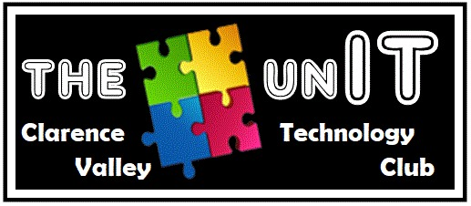

>**_Help wanted with HTML/CSS and ASP.NET User Interface. See CONTRIBUTING.MD for details_**

# Technology Club Management Software
Blazor Server web app to assist in the management of The UNIT Technology Club for autistic teens.

The UNIT is a Not-For-Profit technology club based in the Clarence Valley of NSW, and uses technology and games to help high functioning autistic kids learn communications skills valuable for their future success.

The aim of this software is to provide a centralised place for administrative functions.

This software is in early beta stage.  Additional features are constantly being added as the need arises.

Current and planned features of this software:
   - [x] Display / Edit list of currently available activities
   - [x] Add individual notices to appear on the main page
   - [x] List and edit existing announcements/notices
   - [x] Individual user logins
   - [ ] Record member details
   - [ ] Record member attendance
   - [ ] Record and manage member behaviour
   - [ ] Role based authentication
   - [ ] Secure User Management

Other items will be added to this list as needs are identified.

This is an ASP.NET Core Blazor Server application, and is intended to be hosted on a Linux server running DotNet Core 3.1 or higher.

